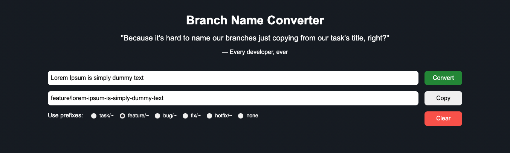

# Branch Name Converter
The Git branch names converter is a software application designed to help developers convert existing branch names into
a standardized format. When working on a project with multiple collaborators, it's crucial to maintain consistency in
naming conventions to ensure clear communication and avoid confusion. You can try it here https://react-branch-name-converter.web.app

## Features
The Branch Name Convert App includes the following features:

1. Convert branch names: Easily convert branch names to kebab-case format.
2. Prefixes: User can choose a prefix that will be added to the beginning of the line.
3. Copy to clipboard: Copy the converted branch name to your clipboard with just one click.
4. Responsive design: The app is optimized for mobile and desktop devices.

## Setup project
1. Clone the repository from GitHub `$ git clone https://github.com/NPavliuk/string-converter.git`.
2. Install the dependencies using `npm install`.
3. Run the app using `npm run dev`.
4. Navigate to http://localhost:3000 in your browser.

## Technologies
* React 18.2
* Redux 4.2
* SASS
